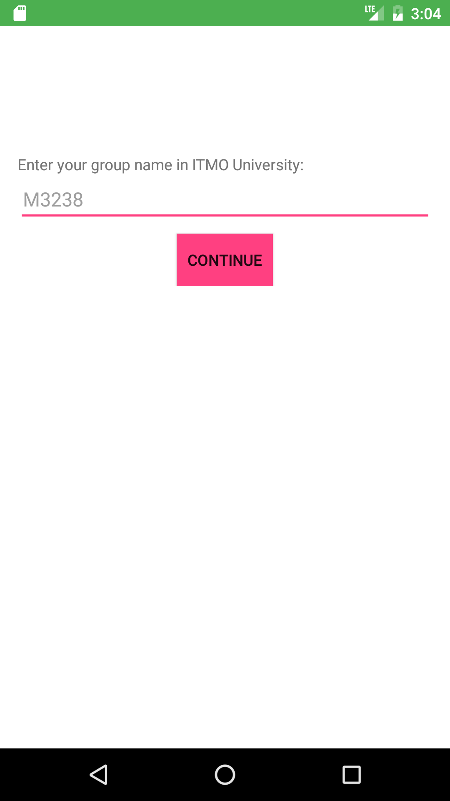
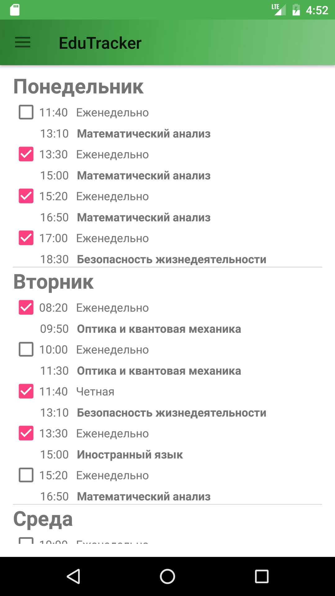
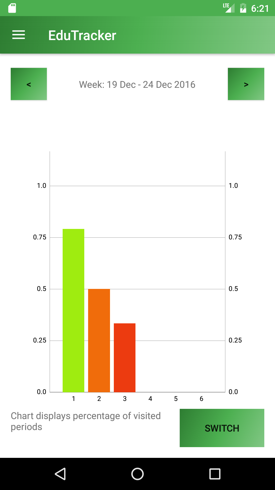
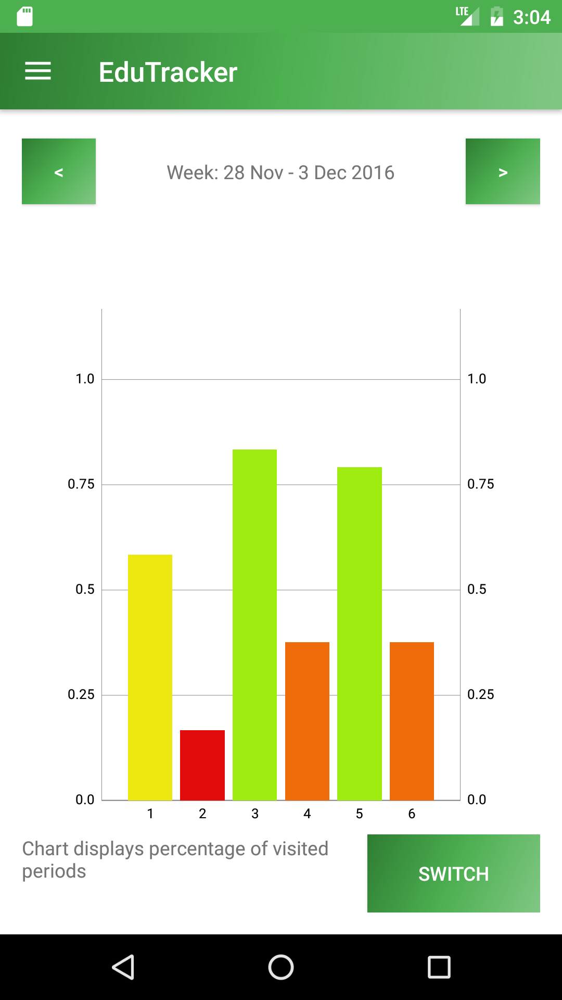
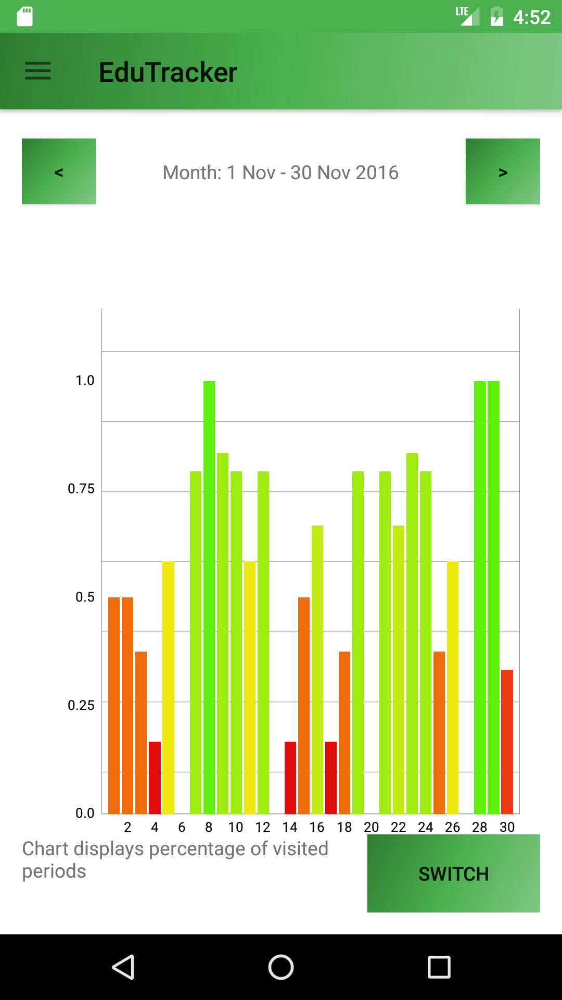

# EduTracker

Our goal is to create an Android application to gather stats about student's attendance of periods in ITMO University. This app is a semester project for Android Application Development course in ITMO University, fall 2016, of students [Aleksandr Tukallo](https://github.com/SubutaiBogatur), [Vitalii Karavaev](https://github.com/karavaevitalii) and [Mekhrubon Turaev](https://github.com/MekhrubonT). 

When a student from ITMO University downloades an app, he enters the group name. His schedule is then downloaded and parsed from [ITMO website](http://www.ifmo.ru/ru/schedule/) using ITMO API. Then the schedule is displayed in `ScheduleActivity`, where each period has its corresponding checkbox, which state tells an app if period was visited by a student.

During every week student marks all the visited periods and our app collects data to display it graphically using [MPAndroidChart](https://github.com/PhilJay/MPAndroidChart) library in `ChartActivity`. Each day in the chart has its corresponding bar which height is the percentage of visited periods that day. Charts can be built for every week or month, which has some data about attendance.

Entering the group name and schedule with checkboxes:

Charts of attendance for a week and a month:

We strongly hope that visualised statistics of attendance will motivate students to visit more periods to improve previous week's result or to compete with friends. As a result, students will be smarter and less lazy!

Our app already has its main functionality, though we are planning to add some more features such as:
* Options activity to change current group name and download another schedule
* Possibility to gather attendance data without using checkboxes, but with geolocation. For example by comparing current address with University address during the period.
