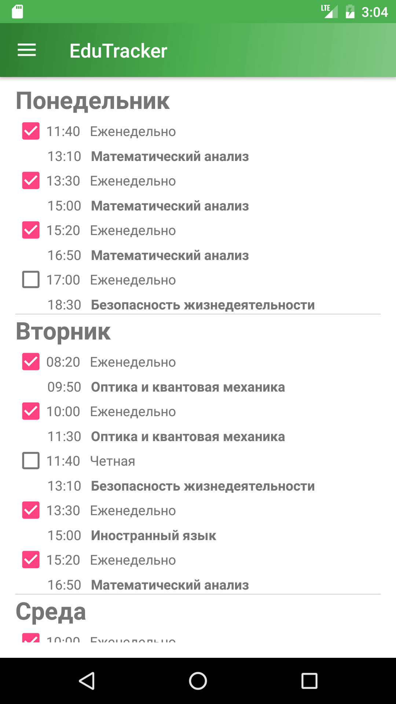
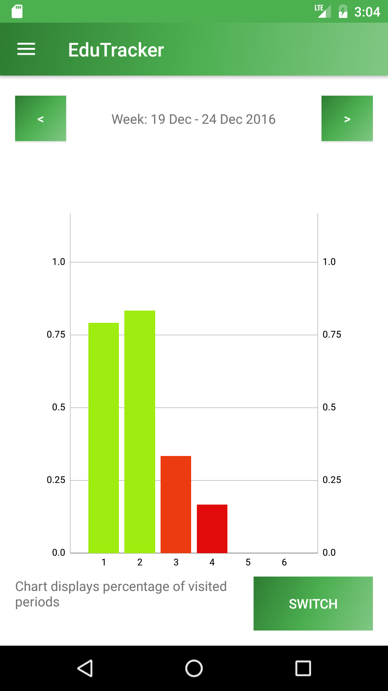
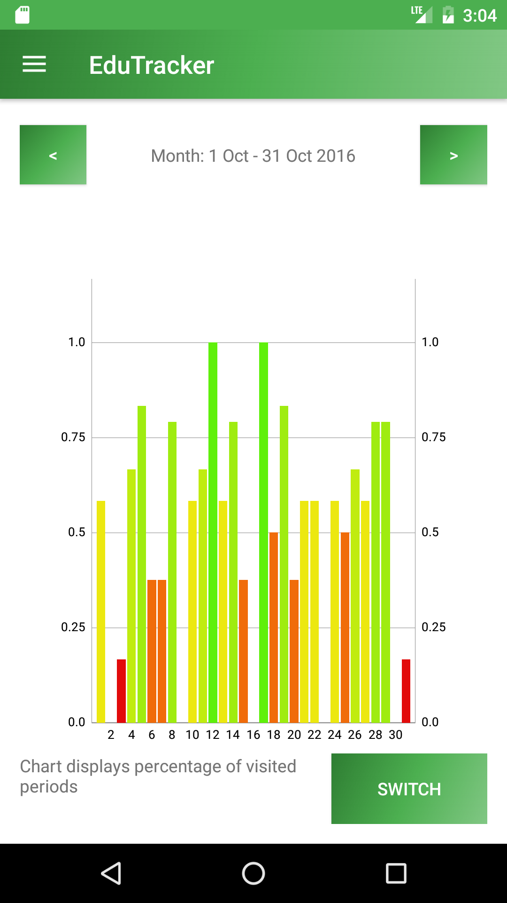

# EduTracker

Цель нашего проекта — создать приложение, отслеживающее посещаемость студента Университета ИТМО. Студент выбирает группу, приложение получает расписание через **API** ИТМО, парсит его, отображает в `ScheduleActivity`. Затем можно отмечать пары, которые были посещены с помощью чекбоксов. На основании собранной статистики в `StatsActivity` строятся графики, отображающие процент посещаемости пар в определенный день.

Приложение является семестровым проектом студентов 2 курса ИТМО: Караваева Виталия, Тукалло Александра, Тураева Мехрубона.

Для отрисовки графиков используется сторонняя библиотека [**MPAndroidChart**](https://github.com/PhilJay/MPAndroidChart). Приложение имеет 3 `activity`: `ChooseGroupActivity`, `ScheduleActivity`, `StatsActivity`. Навигация между activities осуществялется через `NavigationBar`.

Выбор группы и расписание с чекбоксами:

Графики посещаемости в течение недели и месяца:

В текущий момент API ИТМО для получения расписания отключено, тк началась сессия и расписание неактуально. Поэтому, для демонстрации возможностей приложения, расписание выгружается с тестового адреса, где лежит ранее выгруженный `json`.

К приложению планируется в течение месяца добавить:
* Возможность определять, посещена ли пара через геолокацию
* Активити с настройками. В частности, изменение номера группы и смена языка